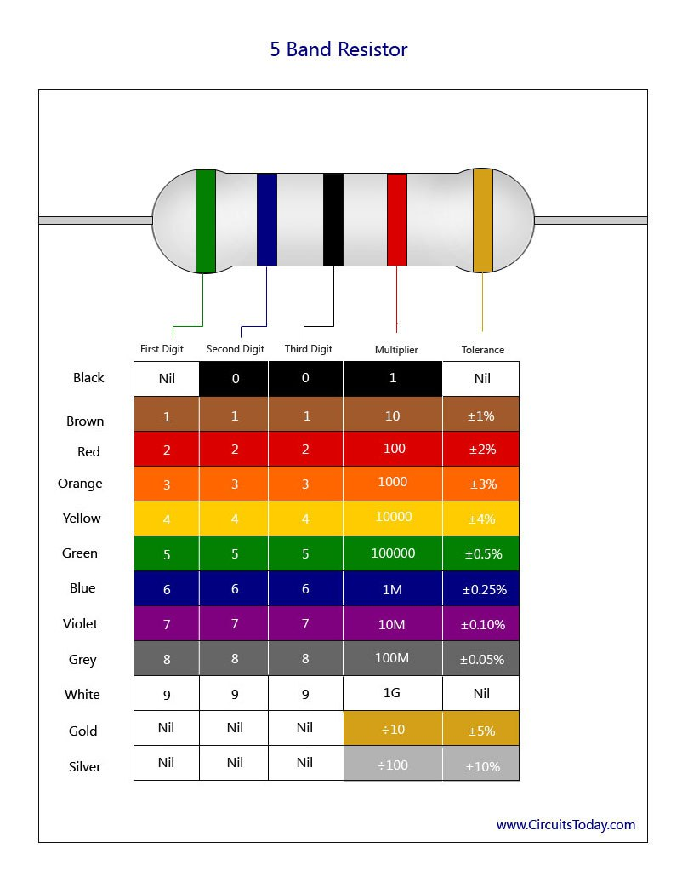

# Resistors
How to use Resistors in circuits 
# resistor color codes
Resistor Colour Coding uses coloured bands to easily identify a resistors resistive value and its percentage tolerance

There are many different types of Resistor available which can be used in both electrical and electronic circuits to control the flow of current or to produce a voltage drop in many different ways. But in order to do this the actual resistor needs to have some form of “resistive” or “resistance” value. Resistors are available in a range of different resistance values from fractions of an Ohm ( Ω ) to millions of Ohms

Obviously, it would be impractical to have available resistors of every possible value for example, 1Ω, 2Ω, 3Ω, 4Ω etc, because literally tens of hundreds of thousands, if not tens of millions of different resistors would need to exist to cover all the possible values. Instead, resistors are manufactured in what are called “preferred values” with their resistance value printed onto their body in coloured ink

